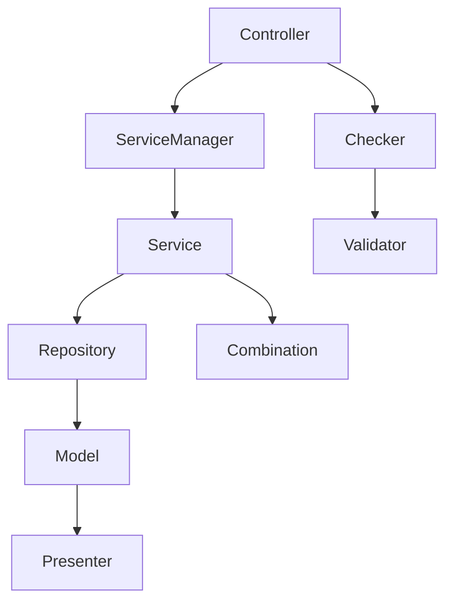

# Laravel Framework Best Practices

This guideline compiles best practices for Laravel architecture design and development, suitable for PHP projects.

## Architecture Design
- Use advanced layered design (Controller, ServiceManager, Service, Repository, Model, Presenter, Checker, Validator, CombinationManager, Combination).
- Clearly separate business logic, data access, validation, and data integration.
- Use Combination & Cache architecture to enhance code reusability and maintainability.

## Main Component Descriptions
- Controller: Controls data flow and transaction management.
- Service/ServiceManager: Handles and integrates business logic.
- Repository: Data access logic, isolates database operations.
- Checker/Validator: Data validation layers.
- Combination/CombinationManager: Data integration and multi-service data composition.
- Model/Presenter: Table definitions and data format conversion.

## Layered Architecture Example

> This file is self-contained and does not rely on external links. It can be expanded according to actual project needs.