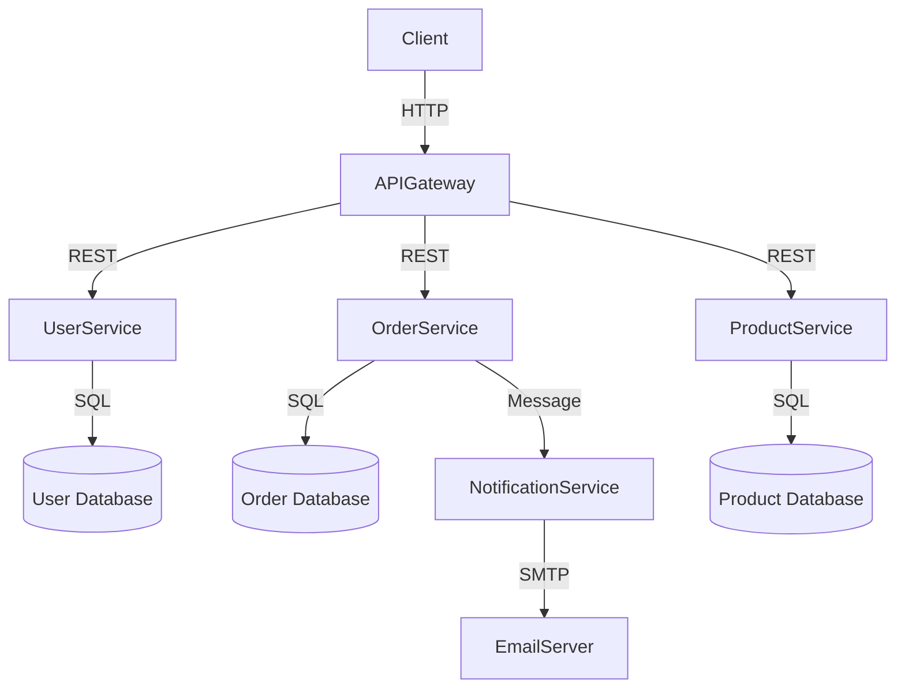

# Architecture Design Principles (Backend General)

This guideline compiles general principles for backend system architecture design, applicable to most backend languages and frameworks.

## Core Architecture Design

- Microservices design: Clearly define service boundaries, communication protocols, and independent deployment strategies.
- API-first design: Design stable API contracts before implementing internal logic.
- Service layering: Clearly separate presentation, business logic, and data access layers.
- Domain-driven design: Use business domain models to guide system structure and logic design.
- Event-driven architecture: Use events to achieve loosely coupled communication between system components.
- Stateless service design: Externalize state to improve replaceability and scalability.
- Anti-corruption layer pattern: Build an anti-corruption layer to isolate third-party services and reduce the impact of external changes.

## Further Reading and Examples

- For detailed design cases, Mermaid architecture diagrams, and framework layering examples, refer to the "Appendix" below or integrate directly into this file.

---

## Appendix: Mermaid Architecture Diagram and Layering Example

### Advanced Laravel Layered Design (COMBINATION & CACHE)

- Controller → ServiceManager → Service → Repository → Model/Presenter
- Checker/Validator: Data validation layer
- Combination/CombinationManager: Data integration and multi-service data composition

> This file is self-contained and does not rely on external links. It can be expanded according to actual project needs.