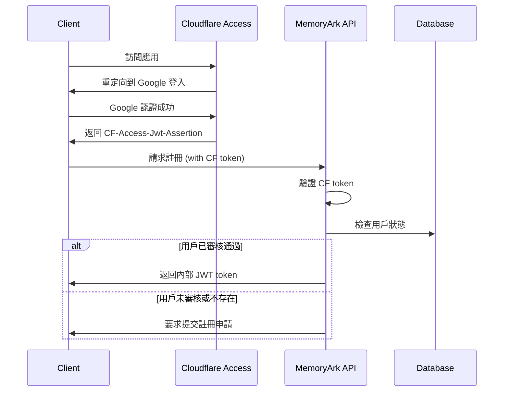

# API 設計文檔

本文檔詳細說明 MemoryArk 2.0 的 REST API 設計規範和端點定義。

## 目錄

- [API 設計原則](#api-設計原則)
- [認證與授權](#認證與授權)
- [請求與響應格式](#請求與響應格式)
- [錯誤處理](#錯誤處理)
- [API 端點](#api-端點)
- [數據模型](#數據模型)
- [API 版本控制](#api-版本控制)

## API 設計原則

### RESTful 設計
- 使用標準 HTTP 方法（GET, POST, PUT, DELETE）
- 資源導向的 URL 設計
- 無狀態設計
- 使用 HTTP 狀態碼表示操作結果

### 命名規範
- URL 使用小寫字母和連字符
- 資源名稱使用複數形式
- 保持 URL 簡潔明確

### 回應格式
- 統一使用 JSON 格式
- 包含標準的錯誤訊息格式
- 支援分頁和過濾

## 認證與授權

### 雙層認證機制

1. **第一層：Cloudflare Access**
   - 所有請求必須通過 Cloudflare Access 驗證
   - 在 Header 中包含 `CF-Access-Jwt-Assertion`

2. **第二層：內部 JWT**
   - 用於內部用戶狀態驗證
   - 在 Header 中包含 `Authorization: Bearer <token>`

### 認證流程



## 請求與響應格式

### 請求 Headers

```http
Content-Type: application/json
CF-Access-Jwt-Assertion: <cloudflare-jwt-token>
Authorization: Bearer <internal-jwt-token>
```

### 成功響應格式

```json
{
  "success": true,
  "data": {
    // 實際數據
  },
  "message": "操作成功",
  "timestamp": "2024-12-19T10:30:00Z"
}
```

### 分頁響應格式

```json
{
  "success": true,
  "data": {
    "items": [...],
    "pagination": {
      "page": 1,
      "limit": 20,
      "total": 100,
      "totalPages": 5,
      "hasNext": true,
      "hasPrev": false
    }
  },
  "message": "獲取成功",
  "timestamp": "2024-12-19T10:30:00Z"
}
```

## 錯誤處理

### 錯誤響應格式

```json
{
  "success": false,
  "error": {
    "code": "VALIDATION_ERROR",
    "message": "請求參數驗證失敗",
    "details": [
      {
        "field": "email",
        "message": "電子郵件格式不正確"
      }
    ]
  },
  "timestamp": "2024-12-19T10:30:00Z"
}
```

### 標準錯誤碼

| HTTP 狀態碼 | 錯誤碼 | 說明 |
|------------|--------|------|
| 400 | VALIDATION_ERROR | 請求參數驗證失敗 |
| 401 | UNAUTHORIZED | 未認證或認證失敗 |
| 403 | FORBIDDEN | 權限不足 |
| 404 | NOT_FOUND | 資源不存在 |
| 409 | CONFLICT | 資源衝突 |
| 413 | FILE_TOO_LARGE | 文件太大 |
| 415 | UNSUPPORTED_MEDIA_TYPE | 不支援的文件類型 |
| 429 | RATE_LIMIT_EXCEEDED | 請求頻率超限 |
| 500 | INTERNAL_ERROR | 服務器內部錯誤 |

## API 端點

### 基礎資訊

**Base URL**: `https://your-domain.com/api/v1`

### 1. 認證相關 API

#### 1.1 用戶註冊申請

```http
POST /auth/register
```

**請求體**:
```json
{
  "name": "張三",
  "phone": "0912345678",
  "church": "台北教會",
  "reason": "教會媒體管理需求"
}
```

**響應**:
```json
{
  "success": true,
  "data": {
    "requestId": "req_123456",
    "status": "pending",
    "submittedAt": "2024-12-19T10:30:00Z"
  },
  "message": "註冊申請已提交，等待管理員審核"
}
```

#### 1.2 檢查註冊狀態

```http
GET /auth/status
```

**響應**:
```json
{
  "success": true,
  "data": {
    "status": "approved|pending|rejected",
    "user": {
      "id": "user_123",
      "email": "user@example.com",
      "name": "張三",
      "role": "user",
      "approvedAt": "2024-12-19T12:00:00Z"
    },
    "token": "jwt_token_here"
  }
}
```

#### 1.3 用戶登出

```http
POST /auth/logout
```

### 2. 用戶管理 API

#### 2.1 獲取用戶資料

```http
GET /users/profile
```

**響應**:
```json
{
  "success": true,
  "data": {
    "id": "user_123",
    "email": "user@example.com",
    "name": "張三",
    "phone": "0912345678",
    "church": "台北教會",
    "role": "user",
    "createdAt": "2024-12-19T10:00:00Z",
    "lastLoginAt": "2024-12-19T10:30:00Z"
  }
}
```

#### 2.2 更新用戶資料

```http
PUT /users/profile
```

**請求體**:
```json
{
  "name": "張三",
  "phone": "0912345678",
  "church": "台北教會"
}
```

### 3. 文件管理 API

#### 3.1 上傳文件

```http
POST /files/upload
```

**請求**: `multipart/form-data`
- `file`: 文件數據
- `category`: 文件分類 (audio|video|document|image)
- `description`: 文件描述 (可選)

**響應**:
```json
{
  "success": true,
  "data": {
    "id": "file_123",
    "filename": "example.mp3",
    "originalName": "聖歌錄音.mp3",
    "size": 5242880,
    "mimeType": "audio/mpeg",
    "category": "audio",
    "description": "主日聖歌錄音",
    "url": "/api/v1/files/file_123/download",
    "thumbnailUrl": "/api/v1/files/file_123/thumbnail",
    "uploadedAt": "2024-12-19T10:30:00Z",
    "uploadedBy": "user_123"
  }
}
```

#### 3.2 獲取文件列表

```http
GET /files?page=1&limit=20&category=audio&search=聖歌
```

**查詢參數**:
- `page`: 頁碼 (默認 1)
- `limit`: 每頁數量 (默認 20, 最大 100)
- `category`: 文件分類過濾
- `search`: 搜索關鍵字
- `sort`: 排序方式 (date_desc|date_asc|name_asc|name_desc|size_desc|size_asc)

**響應**:
```json
{
  "success": true,
  "data": {
    "items": [
      {
        "id": "file_123",
        "filename": "example.mp3",
        "originalName": "聖歌錄音.mp3",
        "size": 5242880,
        "mimeType": "audio/mpeg",
        "category": "audio",
        "description": "主日聖歌錄音",
        "url": "/api/v1/files/file_123/download",
        "thumbnailUrl": "/api/v1/files/file_123/thumbnail",
        "uploadedAt": "2024-12-19T10:30:00Z",
        "uploadedBy": "user_123",
        "uploaderName": "張三"
      }
    ],
    "pagination": {
      "page": 1,
      "limit": 20,
      "total": 100,
      "totalPages": 5,
      "hasNext": true,
      "hasPrev": false
    }
  }
}
```

#### 3.3 獲取文件詳情

```http
GET /files/{fileId}
```

**響應**:
```json
{
  "success": true,
  "data": {
    "id": "file_123",
    "filename": "example.mp3",
    "originalName": "聖歌錄音.mp3",
    "size": 5242880,
    "mimeType": "audio/mpeg",
    "category": "audio",
    "description": "主日聖歌錄音",
    "url": "/api/v1/files/file_123/download",
    "thumbnailUrl": "/api/v1/files/file_123/thumbnail",
    "metadata": {
      "duration": 240,
      "bitrate": "128kbps",
      "format": "MP3"
    },
    "uploadedAt": "2024-12-19T10:30:00Z",
    "uploadedBy": "user_123",
    "uploaderName": "張三"
  }
}
```

#### 3.4 下載文件

```http
GET /files/{fileId}/download
```

**響應**: 二進制文件流

#### 3.5 獲取縮圖

```http
GET /files/{fileId}/thumbnail
```

**響應**: 圖片文件流

#### 3.6 更新文件資訊

```http
PUT /files/{fileId}
```

**請求體**:
```json
{
  "description": "更新的文件描述",
  "category": "audio"
}
```

#### 3.7 刪除文件

```http
DELETE /files/{fileId}
```

### 4. 媒體處理 API

#### 4.1 音頻轉換

```http
POST /media/audio/convert
```

**請求體**:
```json
{
  "fileId": "file_123",
  "format": "mp3|wav|aac",
  "bitrate": "128k|192k|256k|320k",
  "quality": "low|medium|high"
}
```

**響應**:
```json
{
  "success": true,
  "data": {
    "taskId": "task_123",
    "status": "processing",
    "progress": 0,
    "estimatedTime": 120
  }
}
```

#### 4.2 獲取處理狀態

```http
GET /media/tasks/{taskId}
```

**響應**:
```json
{
  "success": true,
  "data": {
    "taskId": "task_123",
    "status": "completed|processing|failed",
    "progress": 100,
    "resultFileId": "file_456",
    "resultUrl": "/api/v1/files/file_456/download",
    "createdAt": "2024-12-19T10:30:00Z",
    "completedAt": "2024-12-19T10:32:00Z"
  }
}
```

### 5. 管理員 API

#### 5.1 獲取註冊申請列表

```http
GET /admin/registration-requests?page=1&limit=20&status=pending
```

**權限**: 需要管理員角色

**響應**:
```json
{
  "success": true,
  "data": {
    "items": [
      {
        "id": "req_123",
        "email": "user@example.com",
        "name": "張三",
        "phone": "0912345678",
        "church": "台北教會",
        "reason": "教會媒體管理需求",
        "status": "pending",
        "submittedAt": "2024-12-19T10:30:00Z"
      }
    ],
    "pagination": {
      "page": 1,
      "limit": 20,
      "total": 10,
      "totalPages": 1,
      "hasNext": false,
      "hasPrev": false
    }
  }
}
```

#### 5.2 審核註冊申請

```http
POST /admin/registration-requests/{requestId}/approve
```

**請求體**:
```json
{
  "action": "approve|reject",
  "reason": "審核意見" // reject 時必須
}
```

**響應**:
```json
{
  "success": true,
  "data": {
    "requestId": "req_123",
    "status": "approved",
    "processedAt": "2024-12-19T11:00:00Z",
    "processedBy": "admin_456"
  },
  "message": "用戶註冊申請已批准"
}
```

#### 5.3 用戶管理

```http
GET /admin/users?page=1&limit=20&role=user&status=active
```

**響應**:
```json
{
  "success": true,
  "data": {
    "items": [
      {
        "id": "user_123",
        "email": "user@example.com",
        "name": "張三",
        "phone": "0912345678",
        "church": "台北教會",
        "role": "user",
        "status": "active",
        "createdAt": "2024-12-19T10:00:00Z",
        "lastLoginAt": "2024-12-19T10:30:00Z"
      }
    ],
    "pagination": {
      "page": 1,
      "limit": 20,
      "total": 50,
      "totalPages": 3,
      "hasNext": true,
      "hasPrev": false
    }
  }
}
```

#### 5.4 更新用戶狀態

```http
PUT /admin/users/{userId}/status
```

**請求體**:
```json
{
  "status": "active|suspended|deactivated",
  "reason": "狀態變更原因"
}
```

### 6. 系統 API

#### 6.1 健康檢查

```http
GET /health
```

**響應**:
```json
{
  "success": true,
  "data": {
    "status": "healthy",
    "timestamp": "2024-12-19T10:30:00Z",
    "version": "0.1.0",
    "uptime": 3600,
    "services": {
      "database": "healthy",
      "storage": "healthy",
      "cache": "healthy"
    }
  }
}
```

#### 6.2 系統資訊

```http
GET /system/info
```

**權限**: 需要管理員角色

**響應**:
```json
{
  "success": true,
  "data": {
    "version": "0.1.0",
    "buildTime": "2024-12-19T10:00:00Z",
    "environment": "production",
    "uptime": 3600,
    "statistics": {
      "totalUsers": 100,
      "totalFiles": 500,
      "totalStorage": "10.5GB",
      "activeUsers24h": 25
    }
  }
}
```

## 數據模型

### User (用戶)

```json
{
  "id": "string",
  "email": "string",
  "name": "string",
  "phone": "string",
  "church": "string",
  "role": "admin|user",
  "status": "active|suspended|deactivated",
  "cloudflareId": "string",
  "createdAt": "datetime",
  "updatedAt": "datetime",
  "approvedBy": "string",
  "approvedAt": "datetime",
  "lastLoginAt": "datetime"
}
```

### UserRegistrationRequest (用戶註冊申請)

```json
{
  "id": "string",
  "email": "string",
  "name": "string",
  "phone": "string",
  "church": "string",
  "reason": "string",
  "status": "pending|approved|rejected",
  "submittedAt": "datetime",
  "processedAt": "datetime",
  "processedBy": "string",
  "processingNotes": "string"
}
```

### File (文件)

```json
{
  "id": "string",
  "filename": "string",
  "originalName": "string",
  "size": "integer",
  "mimeType": "string",
  "category": "audio|video|document|image",
  "description": "string",
  "filePath": "string",
  "thumbnailPath": "string",
  "metadata": "object",
  "uploadedBy": "string",
  "uploadedAt": "datetime",
  "updatedAt": "datetime"
}
```

### MediaTask (媒體處理任務)

```json
{
  "id": "string",
  "type": "audio_convert|video_convert|thumbnail_generate",
  "inputFileId": "string",
  "outputFileId": "string",
  "parameters": "object",
  "status": "pending|processing|completed|failed",
  "progress": "integer",
  "errorMessage": "string",
  "createdBy": "string",
  "createdAt": "datetime",
  "startedAt": "datetime",
  "completedAt": "datetime"
}
```

## API 版本控制

### 版本策略
- 使用 URL 路徑版本控制：`/api/v1/`
- 主要版本變更時創建新版本：`/api/v2/`
- 保持向下兼容性至少一個主要版本

### 版本標頭
客戶端可以通過 Header 指定 API 版本：
```http
Accept: application/vnd.memoryark.v1+json
```

### 廢棄策略
1. 新版本發布時標記舊版本為廢棄
2. 提供至少 6 個月的過渡期
3. 在響應中添加廢棄警告：
```http
Warning: 299 - "API version 1 is deprecated. Please upgrade to version 2"
```

## 速率限制

### 限制規則
- 一般 API：100 requests/minute per user
- 上傳 API：10 requests/minute per user
- 管理員 API：200 requests/minute per admin

### 限制標頭
```http
X-RateLimit-Limit: 100
X-RateLimit-Remaining: 95
X-RateLimit-Reset: 1640781600
```

### 超限響應
```http
HTTP/1.1 429 Too Many Requests
```

```json
{
  "success": false,
  "error": {
    "code": "RATE_LIMIT_EXCEEDED",
    "message": "請求頻率超限，請稍後再試",
    "retryAfter": 60
  }
}
```

## WebSocket API

### 即時通知
```
WSS /api/v1/ws/notifications
```

**連接參數**:
- `token`: JWT 認證令牌

**事件類型**:

1. **文件上傳進度**
```json
{
  "type": "upload_progress",
  "data": {
    "fileId": "file_123",
    "progress": 75,
    "bytesUploaded": 3932160,
    "totalBytes": 5242880
  }
}
```

2. **媒體處理進度**
```json
{
  "type": "media_processing",
  "data": {
    "taskId": "task_123",
    "status": "processing",
    "progress": 50
  }
}
```

3. **註冊申請狀態更新**
```json
{
  "type": "registration_status",
  "data": {
    "requestId": "req_123",
    "status": "approved",
    "message": "您的註冊申請已通過審核"
  }
}
```

## 安全考慮

### HTTPS
- 所有 API 端點必須使用 HTTPS
- 強制執行 TLS 1.2 或更高版本

### CORS
```http
Access-Control-Allow-Origin: https://your-domain.com
Access-Control-Allow-Methods: GET, POST, PUT, DELETE, OPTIONS
Access-Control-Allow-Headers: Content-Type, Authorization, CF-Access-Jwt-Assertion
Access-Control-Allow-Credentials: true
```

### 內容安全
- 文件上傳時進行病毒掃描
- 限制允許的文件類型
- 驗證文件內容與擴展名一致性

### 敏感資料處理
- 密碼使用 bcrypt 雜湊
- JWT 使用強隨機密鑰
- 敏感日誌不記錄用戶資料

這份 API 設計文檔將作為開發團隊的技術規範，確保前後端開發的一致性和系統的可維護性。
