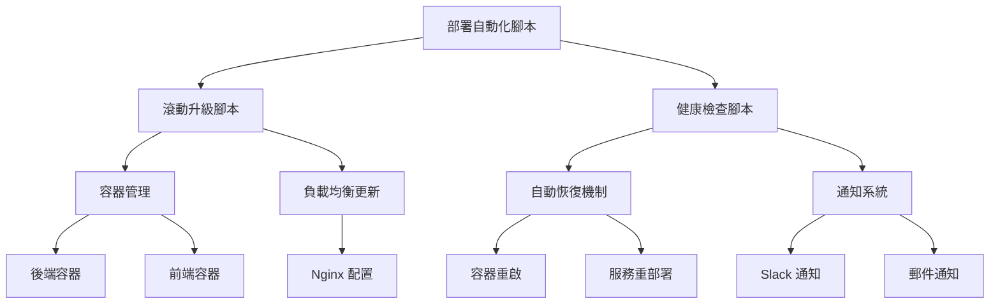
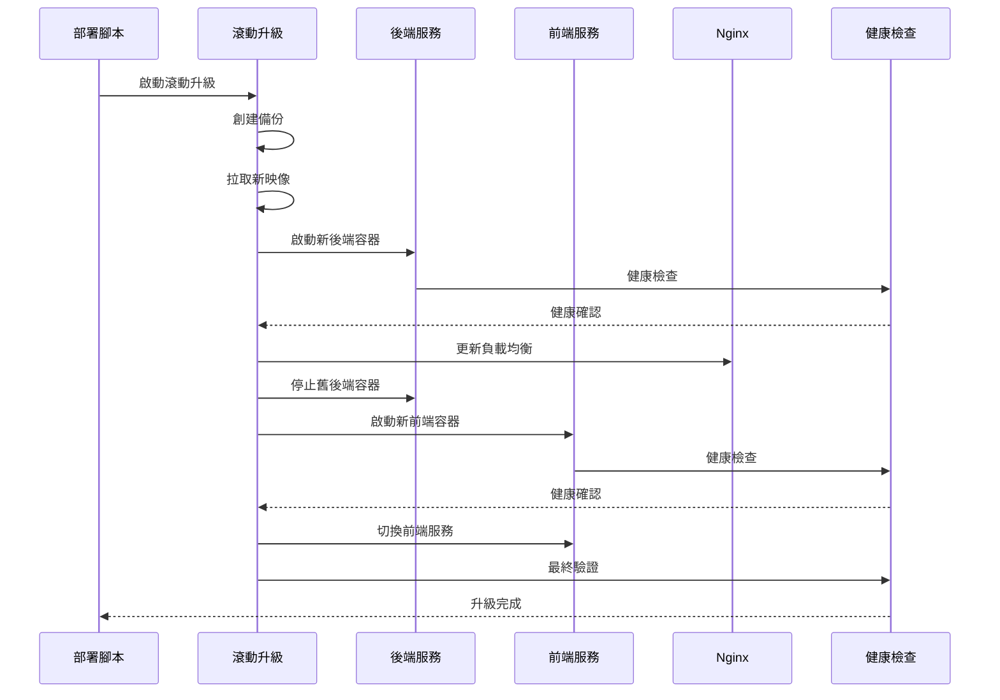
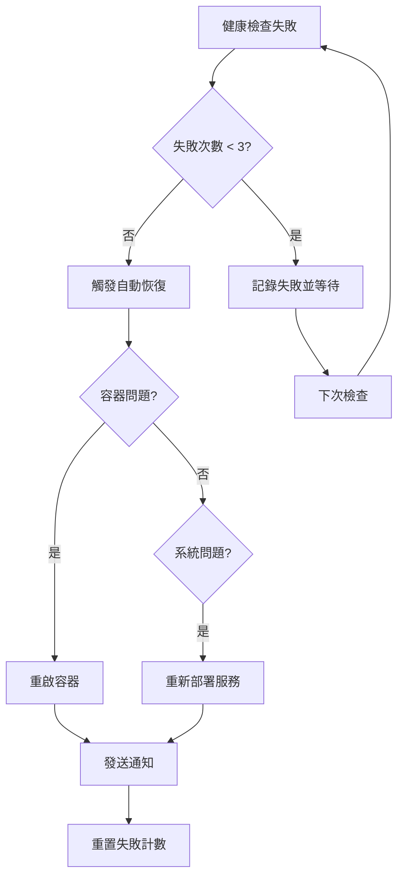

# MemoryArk 2.0 滾動升級系統文檔

## 概述

MemoryArk 2.0 實現了完整的零停機滾動升級系統，確保生產環境在升級過程中持續提供服務。本系統包含自動化部署、健康檢查、自動恢復和完整的監控機制。

## 系統架構

### 部署組件



### 核心腳本

1. **`deploy-automation.sh`** - 主要部署自動化腳本
2. **`rolling-upgrade.sh`** - 滾動升級實現
3. **`health-check.sh`** - 健康檢查和監控
4. **環境配置文件** - `deploy/production.env` 和 `deploy/staging.env`

## 滾動升級流程

### 升級步驟



### 關鍵特性

#### 零停機升級
- **藍綠部署**：同時運行新舊版本，確保服務連續性
- **漸進式切換**：先切換後端，再切換前端
- **健康檢查**：每個步驟都進行健康驗證
- **自動回滾**：失敗時自動回滾到穩定版本

#### 安全機制
- **完整備份**：升級前自動備份資料庫和配置
- **配置驗證**：升級前檢查所有必要的環境變數
- **版本追蹤**：記錄每次部署的詳細資訊
- **權限控制**：只有授權用戶可執行部署

## 使用指南

### 環境準備

#### 1. 安裝依賴
```bash
# 安裝 Podman
sudo apt-get update
sudo apt-get install podman

# 安裝其他工具
sudo apt-get install jq curl git
```

#### 2. 配置環境
```bash
# 創建部署用戶
sudo useradd -m -s /bin/bash memoryark
sudo usermod -aG sudo memoryark

# 創建必要目錄
sudo mkdir -p /home/memoryark/{data,uploads,logs,backups}
sudo chown -R memoryark:memoryark /home/memoryark/
```

#### 3. 設置環境變數
```bash
# 複製環境配置文件
cp deploy/production.env.example deploy/production.env

# 編輯生產環境配置
vim deploy/production.env
```

### 部署操作

#### 完整部署流程
```bash
# 執行完整部署 (構建 + 測試 + 部署)
./scripts/deploy-automation.sh full --environment production --tag v2.0.1

# 強制部署 (跳過確認)
./scripts/deploy-automation.sh full --environment production --force

# 模擬部署 (不實際執行)
./scripts/deploy-automation.sh full --environment production --dry-run
```

#### 分步驟操作
```bash
# 僅構建
./scripts/deploy-automation.sh build --tag v2.0.1

# 僅執行測試
./scripts/deploy-automation.sh test --test-suite all

# 僅部署
./scripts/deploy-automation.sh deploy --environment production --tag v2.0.1

# 回滾
./scripts/deploy-automation.sh rollback --environment production
```

#### 監控和狀態
```bash
# 查看部署狀態
./scripts/deploy-automation.sh status --environment production

# 啟動監控服務
./scripts/deploy-automation.sh monitor --environment production

# 手動健康檢查
./scripts/health-check.sh --environment production --once
```

## 健康檢查系統

### 檢查項目

#### 服務健康檢查
```bash
# 容器狀態檢查
podman ps --filter "name=memoryark-*"

# HTTP 服務檢查
curl -f http://localhost:8080/api/health
curl -f http://localhost:7001/health

# 完整服務鏈檢查
curl -f http://localhost:7001/api/health
```

#### 系統資源檢查
```bash
# 資料庫連接
sqlite3 /path/to/database.db "SELECT COUNT(*) FROM sqlite_master;"

# 磁碟空間 (最低 10% 可用)
df -h / | tail -1 | awk '{print $5}' | sed 's/%//'

# 記憶體使用 (最高 90%)
free | grep Mem | awk '{printf "%.0f", $3/$2 * 100.0}'
```

### 自動恢復機制

#### 失敗處理流程


#### 通知機制
```bash
# Slack 通知
curl -X POST $SLACK_WEBHOOK \
  -H 'Content-type: application/json' \
  --data '{"text":"MemoryArk 健康檢查警報: 服務異常"}'

# 郵件通知
echo "服務健康檢查失敗" | mail -s "MemoryArk 警報" admin@example.com
```

## 配置管理

### 環境配置文件

#### 生產環境 (`production.env`)
```bash
# 關鍵配置
APP_NAME=memoryark
ENVIRONMENT=production
DOMAIN_NAME=files.94work.net

# 資源限制
BACKEND_MEMORY_LIMIT=1GB
BACKEND_CPU_LIMIT=1.0

# 安全配置
JWT_SECRET_KEY=your-super-secret-jwt-key
SSL_CERT_PATH=/etc/ssl/certs/memoryark.crt
```

#### 測試環境 (`staging.env`)
```bash
# 關鍵配置
APP_NAME=memoryark-staging
ENVIRONMENT=staging
DOMAIN_NAME=staging-files.94work.net

# 資源限制 (較小)
BACKEND_MEMORY_LIMIT=512MB
BACKEND_CPU_LIMIT=0.5

# 調試配置
LOG_LEVEL=debug
ENABLE_PROFILING=true
```

### 容器配置

#### 網路設定
```bash
# 創建專用網路
podman network create memoryark-network

# 容器網路配置
--network memoryark-network
--network-alias backend
--network-alias frontend
```

#### 存儲掛載
```bash
# 資料庫掛載
-v "${DATABASE_PATH}:/app/data/memoryark.db"

# 上傳目錄掛載
-v "${UPLOADS_PATH}:/app/uploads"

# 配置文件掛載
-v "${CONFIG_PATH}:/app/config:ro"
```

#### 資源限制
```bash
# 記憶體限制
--memory="${BACKEND_MEMORY_LIMIT}"

# CPU 限制
--cpus="${BACKEND_CPU_LIMIT}"

# 重啟策略
--restart="${RESTART_POLICY}"
```

## 故障排除

### 常見問題

#### 1. 升級失敗
```bash
# 檢查容器日誌
podman logs memoryark-backend

# 檢查健康狀態
curl -v http://localhost:8080/api/health

# 手動回滾
./scripts/rolling-upgrade.sh --environment production --rollback
```

#### 2. 健康檢查失敗
```bash
# 檢查具體失敗原因
./scripts/health-check.sh --environment production --once --verbose

# 檢查系統資源
free -h
df -h
top
```

#### 3. 容器啟動失敗
```bash
# 檢查映像是否存在
podman images | grep memoryark

# 檢查容器配置
podman inspect memoryark-backend

# 檢查端口衝突
ss -tulpn | grep :8080
```

### 調試工具

#### 日誌分析
```bash
# 應用日誌
tail -f /home/memoryark/logs/app.log

# 容器日誌
podman logs -f memoryark-backend

# 系統日誌
journalctl -u memoryark -f
```

#### 效能監控
```bash
# 容器資源使用
podman stats

# 系統資源監控
htop
iotop
nethogs
```

#### 網路診斷
```bash
# 端口檢查
nmap localhost -p 7001,8080

# 連接測試
nc -zv localhost 8080

# HTTP 測試
curl -I http://localhost:7001/
```

## 安全考量

### 權限控制
```bash
# 部署腳本權限
chmod 750 scripts/*.sh
chown memoryark:memoryark scripts/*.sh

# 配置文件權限
chmod 640 deploy/*.env
chown memoryark:memoryark deploy/*.env
```

### 敏感資訊保護
```bash
# 環境變數加密
ansible-vault encrypt deploy/production.env

# 金鑰管理
gpg --encrypt --recipient admin@example.com secrets.txt
```

### 網路安全
```bash
# 防火牆配置
ufw allow 80/tcp
ufw allow 443/tcp
ufw deny 8080/tcp  # 僅內部訪問
```

## 效能優化

### 容器優化
```bash
# 映像大小優化
podman build --squash -t memoryark/backend:optimized .

# 多階段構建
FROM golang:1.22-alpine AS builder
FROM alpine:latest AS runtime
```

### 資源調優
```bash
# 記憶體優化
echo 'vm.swappiness=10' >> /etc/sysctl.conf

# 檔案描述符限制
echo 'fs.file-max = 100000' >> /etc/sysctl.conf

# 網路優化
echo 'net.core.somaxconn = 1024' >> /etc/sysctl.conf
```

## 監控和警報

### Prometheus 集成
```yaml
# prometheus.yml
scrape_configs:
  - job_name: 'memoryark'
    static_configs:
      - targets: ['localhost:9090']
```

### Grafana 儀表板
```json
{
  "dashboard": {
    "title": "MemoryArk 2.0 監控",
    "panels": [
      {
        "title": "服務健康狀態",
        "type": "stat"
      },
      {
        "title": "響應時間",
        "type": "graph"
      }
    ]
  }
}
```

### 警報規則
```yaml
# alerting.yml
groups:
  - name: memoryark
    rules:
      - alert: ServiceDown
        expr: up{job="memoryark"} == 0
        for: 1m
        labels:
          severity: critical
        annotations:
          summary: "MemoryArk 服務離線"
```

## 最佳實踐

### 部署流程
1. **測試環境驗證**：先在 staging 環境測試
2. **分階段部署**：逐步推送到生產環境
3. **監控指標**：密切關注關鍵效能指標
4. **回滾準備**：隨時準備回滾到穩定版本

### 維護建議
1. **定期備份**：自動化資料庫和檔案備份
2. **安全更新**：及時更新基礎映像和依賴
3. **容量規劃**：監控資源使用趨勢
4. **文檔更新**：保持部署文檔同步更新

### 團隊協作
1. **權限分離**：不同環境使用不同權限
2. **變更記錄**：記錄所有部署變更
3. **知識共享**：團隊成員都了解部署流程
4. **應急響應**：建立故障響應流程

## 結論

MemoryArk 2.0 滾動升級系統提供了：

✅ **零停機部署**：藍綠部署策略確保服務連續性  
✅ **自動化流程**：完整的 CI/CD 流程自動化  
✅ **健康監控**：實時監控和自動恢復機制  
✅ **安全保障**：完整的備份和回滾機制  
✅ **靈活配置**：支援多環境部署配置  

系統已準備好在生產環境中提供穩定、可靠的滾動升級服務。